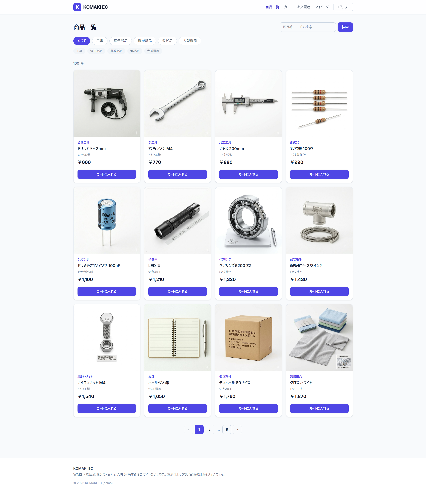
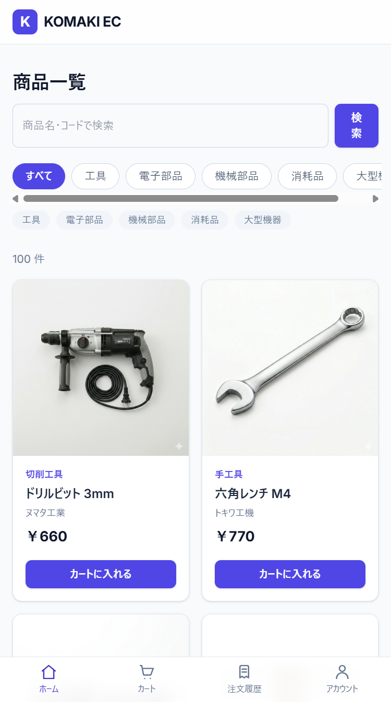
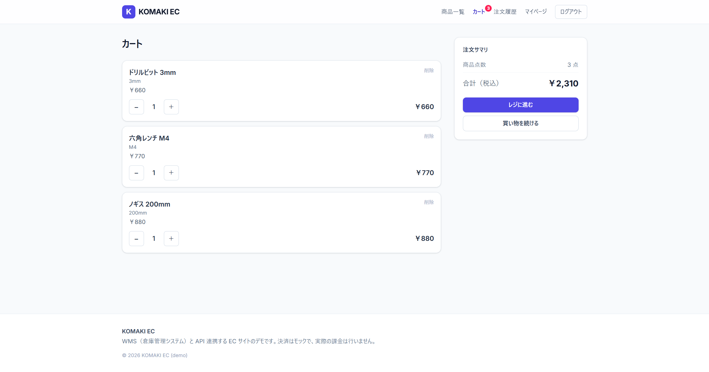
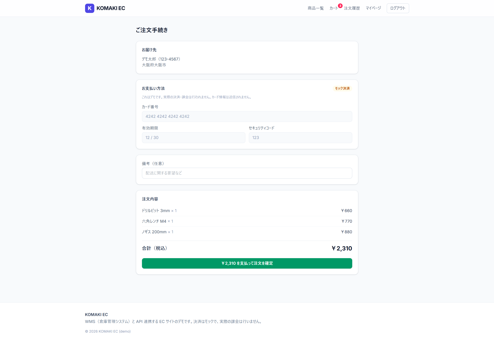
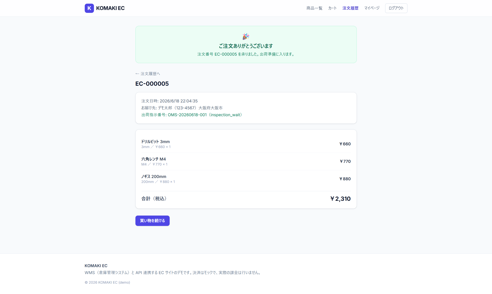
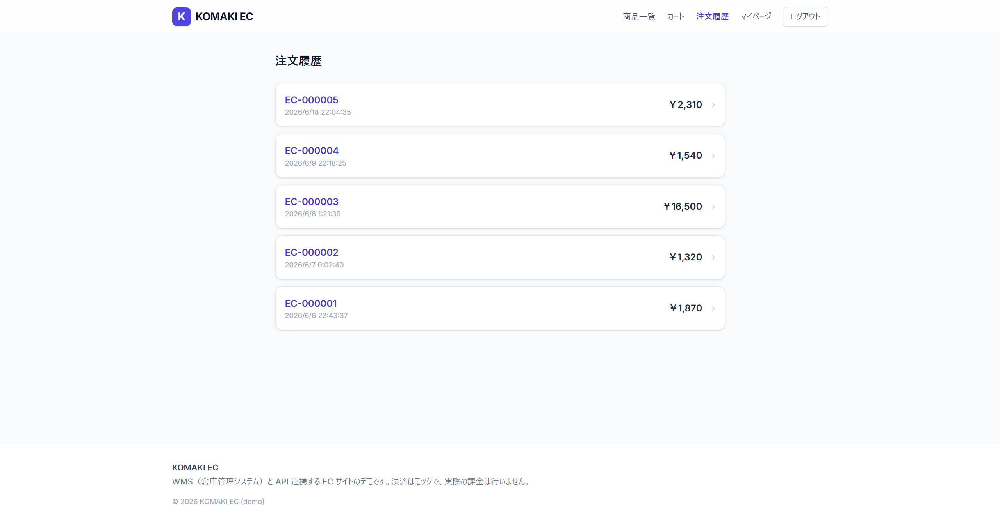
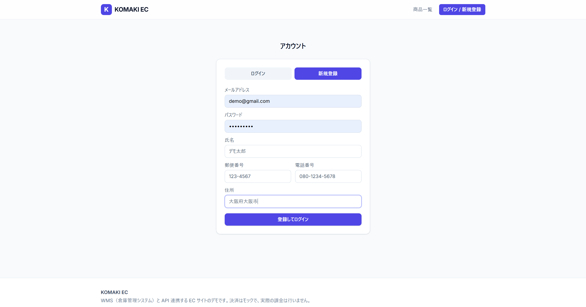
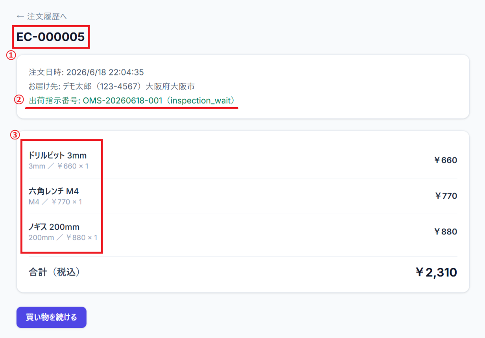
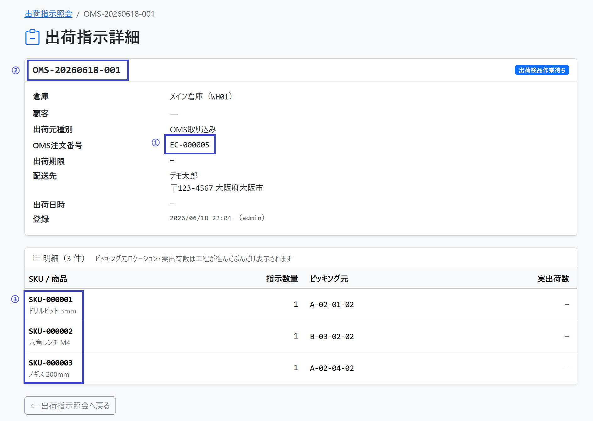

# EC サイト（WMS 連携）

WMS（[komaki-wms](https://github.com/Dev-komaki789/wms)）と連携する EC サイト。
業務系（PC + ハンディ）の WMS に対して、顧客向け SPA を **マイクロサービス的に分離** して構築する。

**公開サイト**: <https://ec.komaki-wms.com>（デモ・決済はモック）

---

## スクリーンショット

### 商品一覧

PC とスマホでレイアウトを最適化（スマホはカテゴリ横スクロール＋下部にボトムナビ）。

| PC | スマホ |
| --- | --- |
|  |  |

### カート〜注文

| カート | 注文手続き |
| --- | --- |
|  |  |

| 注文完了 | 注文履歴 |
| --- | --- |
|  |  |

### ログイン / 新規登録



---

## WMS 連携 — 注文の自動引き当て

このサイトの肝は **WMS（倉庫管理システム）との API 連携**。
EC で注文を確定すると、WMS 側に **出荷指示（OutboundOrder）が自動生成**され、
EC の注文番号（`EC-000005`）で双方が紐づく。WMS 側では SKU ごとに
**ピッキング元ロケーションが自動で引き当て**られ、出荷検品待ちの状態になる。

| EC：注文完了 | WMS：自動生成された出荷指示 |
| --- | --- |
|  |  |

- ① 注文番号 `EC-000005` が WMS の「OMS 注文番号」として連携される
- ② EC は WMS の出荷指示番号 `OMS-20260618-001` とステータス（`inspection_wait` / 出荷検品作業待ち）を取得して表示
- ③ 注文明細（SKU・数量）がそのまま WMS の出荷指示明細に反映される

> **注**: 今回の注文は **AGV（自動搬送ロボット）対象の商品**のため、ピッキングが自動化されており、
> 出荷指示は最初から **「出荷検品作業待ち（`inspection_wait`）」状態**で始まっている。
> AGV 対象外の商品の場合は、手動ピッキング工程を経てからこの状態に進む。

---

## 全体構成

```
┌────────────────┐       ┌────────────────────┐       ┌──────────────────┐
│ EC Frontend    │       │ EC Backend         │       │ WMS              │
│ React +        │       │ Django + DRF       │       │ Django + DRF     │
│ TypeScript     │ ◀──▶ │ - 商品プロキシ      │ ◀──▶ │ - 商品マスタ      │
│ + Vite         │       │ - 価格マスタ        │       │ - 在庫           │
│ (frontend/)    │       │ - カート / 注文     │       │ - 入出庫         │
│                │       │ (backend/)          │       │                  │
└────────────────┘       └────────────────────┘       └──────────────────┘
                              ↓                              ↓
                          EC DB                          WMS DB
                          (PostgreSQL "ec")              (PostgreSQL "wms")
```

## リポジトリ構成（monorepo）

```
ec/
├── backend/          ← Django + DRF プロジェクト（実装予定）
├── frontend/         ← React + TypeScript プロジェクト（実装予定）
├── docs/             ← EC 固有の設計資料（実装と並行して書く）
└── README.md         ← 本ファイル
```

## 関連リポジトリ

- **WMS（連携先・API 提供者）**: <https://github.com/Dev-komaki789/wms>
  - 本 EC サイトは WMS が提供する HTTP API を消費する

## 主要な設計判断（要約）

| 項目 | 採用方針 |
| --- | --- |
| 構成 | 案 Y（マイクロサービス的、EC バックエンド別） |
| DB | 同 RDS 内に `ec` データベース新規作成、論理分離 |
| マスタ管理 | B パターン（EC 側に商品マスタのコピー、日次バッチ同期） |
| 在庫表示 | 段階 1（都度 API 問い合わせ、Redis 未採用、`get_stock()` 関数抽象化） |
| 価格カラム | EC 側 DB に持つ（WMS には追加しない） |
| 認証 | サービス間は API キー、顧客は JWT or Session |
| Customer マスタ | EC 顧客は WMS に同期しない（個人情報リスク回避） |
| 商品画像 | EC 側に保持、本番は AWS S3 |

詳細は WMS リポジトリの `integration/HANDOVER_EC.md` を参照。

## スコープ（最小 MVP 8 機能）

1. 商品一覧（カテゴリ別）
2. 商品詳細
3. カート
4. 注文確定（→ WMS の OutboundOrder 作成）
5. 顧客登録 / ログイン
6. 注文履歴
7. 商品検索
8. 在庫数表示（WMS の StockBalance を API 経由で取得）

---

顧客向け EC と業務系 WMS を **別サービスとして疎結合に連携**させ、注文から倉庫の出荷指示までを
一気通貫で動かすことを目的とした、ポートフォリオ用のデモサイトです（決済はモック）。
